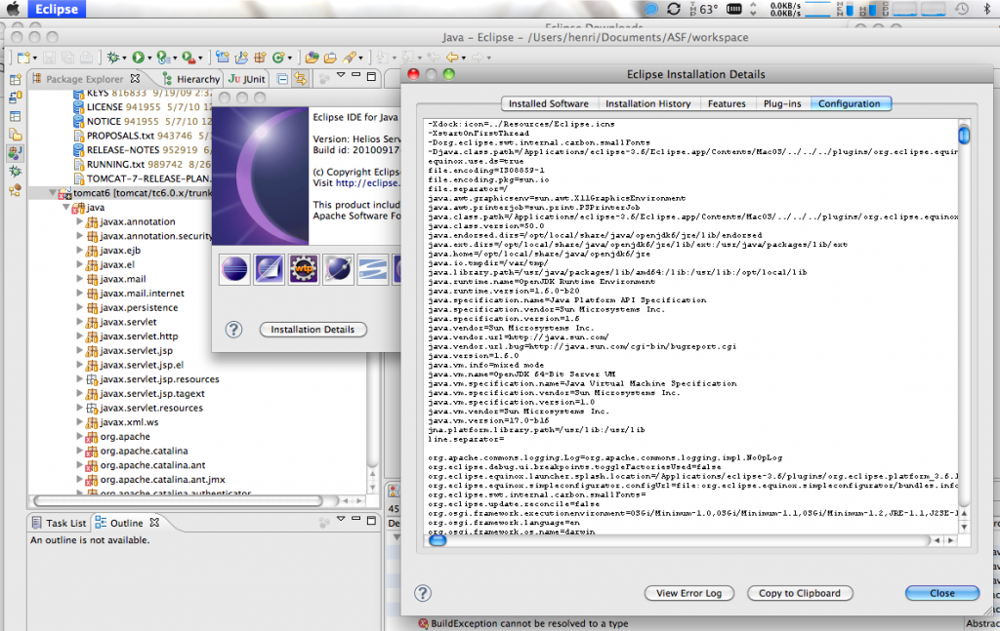

+++
title = 'OSX - OpenJDK 6 vs Apple JDK 6'
date = 2010-11-08T13:20:23+02:00
draft = false
tags = [ 'OpenJDK', 'OSX' ]
categories = [ 'OS' ]
image = 'applejdkopenjdk.png'
+++

From finished building OpenJDK 6 on OS / X Snowleopard, I wanted to test just to see how he behaved towards the implementation of Apple. I used a development version of MacPorts ([see it trac](https://trac.macports.org/ticket/20956)) that appears very promising and got OpenJDK 1.6.0-b20.

`openjdk version "1.6.0" OpenJDK Runtime Environment (build 1.6.0-b20) OpenJDK 64-Bit Server VM (build 17.0-b16, mixed mode)`

## A Java application with GUI under OS/X - OpenJDK

First test was to launched a big application like Eclipse under OS/X with OpenJDK. I selected OpenJDK 6 as default VM by adding the properties file in this eclipse.ini _Eclipse.app / Contents / MacOS / eclipse.ini_

`-vm /opt/local/share/java/openjdk6/bin/java`

It worked pretty well :


A big thank you to SWT / Cocoa since there are still problems with AWT and OS / X

## Speed and stability of OpenJDK

My test system is an Apple Mac Book Pro (MacBookPro5,1) with Intel Core 2 Duo 2.66Ghz and 4Gb DDR3 1067Mhz.

### DaCapo Benchmarks

I do some tests with [DaCapo 9.12-bach](http://www.dacapobench.org/), discarding **batik** test, this one requiring a working AWT/Swing support .

Bench tests launched with -n X, ie (java -jar dacapo-9.12-bach.jar -n 10 pmd)

| Bench                     | Apple JDK6             | OpenJDK 6                  |
| ------------------------- | ---------------------- | -------------------------- |
| avrora (10 iterations)    | 5247ms                 | 4980ms                     |
| eclipse (2 iterations)    | 53292ms                | 34404ms                    |
| fop (10 iterations)       | 560ms                  | 408ms                      |
| h2 (2 iterations)         | Failure (pending test) | 6488ms                     |
| jython (2 iterations)     | 6034ms                 | Failure (Trace/BPT trap)   |
| luindex (10 iterations)   | 1072ms                 | 990ms                      |
| lusearch (10 iterations)  | 5997ms                 | 3957ms                     |
| pmd (10 iterations)       | 3067ms                 | 2890ms                     |
| sunflow (10 iterations)   | 6998ms                 | 6442ms                     |
| tomcat (5 iterations)     | 4108ms                 | Failure (connection reset) |
| tradebeans (5 iterations) | 8257ms                 | Failure (connection reset) |
| tradesoap (5 iterations)  | 20472ms                | 12378ms                    |
| xalan (10 iterations)     | 2877ms                 | 2847ms                     |
Some tests failed under OpenJDK 6, related on Tomcat / IO but as we can see in next section, Tomcat 6 or 7 worked with OpenJDK.

### IO Benchs with ApacheBench and Tomcat6/7

Then I wanted to see the speed of the JVM under IO load and why I made a little stress test two well-known applications, Tomcat 6 and 7. I used [ApacheBench](http://httpd.apache.org/docs/2.2/programs/ab.html) to request 1000000 time a simple URI (/examples/servlets/servlet/RequestInfoExample), with 100 concurrents clients.

ApacheBench and Tomcat were on the same machine, to avoid network bottleneck. Activity Monitor show a CPU load of 120% for Java and 20% for ab

Here also OpenJDK 6 perform well even slighty better than Apple own implementation.

| Tomcat    | Apple JDK 6 | Open JDK 6  |
| --------- | ----------- | ----------- |
| 6.0.29    | 15852 req/s | 16011 req/s |
| 7.0.4beta | 13700 req/s | 14212 req/s |

**Apache 6.0.29 / Open JDK 6** 
```
Server Software: Apache-Coyote/1.1 Server Hostname: localhost Server Port: 8080

Document Path: /examples/servlets/servlet/RequestInfoExample Document Length: 715 bytes`

Concurrency Level: 100 Time taken for tests: 62.456 seconds Complete requests: 1000000 Failed requests: 0 Write errors: 0 Keep-Alive requests: 1000000 Total transferred: 868001736 bytes HTML transferred: 715001430 bytes Requests per second: 16011.35 [#/sec] (mean) Time per request: 6.246 [ms] (mean) Time per request: 0.062 [ms] (mean, across all concurrent requests) Transfer rate: 13572.15 [Kbytes/sec] received

Connection Times (ms) min mean[+/-sd] median max Connect: 0 0 0.0 0 3 Processing: 0 6 3.1 6 123 Waiting: 0 6 3.1 6 123 Total: 0 6 3.1 6 123

Percentage of the requests served within a certain time (ms) 50% 6 66% 6 75% 7 80% 8 90% 9 95% 11 98% 13 99% 15 100% 123 (longest request)
```

**Apache 7.0.4beta / Open JDK 6**
```
Server Software: Apache-Coyote/1.1 Server Hostname: localhost Server Port: 8080`

Document Path: /examples/servlets/servlet/RequestInfoExample Document Length: 683 bytes`

Concurrency Level: 100 Time taken for tests: 70.360 seconds Complete requests: 1000000 Failed requests: 0 Write errors: 0 Keep-Alive requests: 1000000 Total transferred: 855000855 bytes HTML transferred: 683000683 bytes Requests per second: 14212.64 [#/sec] (mean) Time per request: 7.036 [ms] (mean) Time per request: 0.070 [ms] (mean, across all concurrent requests) Transfer rate: 11867.01 [Kbytes/sec] received

Connection Times (ms) min mean[+/-sd] median max Connect: 0 0 0.0 0 3 Processing: 0 7 6.6 6 379 Waiting: 0 7 6.6 6 379 Total: 0 7 6.6 6 379

Percentage of the requests served within a certain time (ms) 50% 6 66% 7 75% 8 80% 9 90% 11 95% 12 98% 14 99% 15 100% 379 (longest request)
```

**Apache 6.0.29 / Apple JDK 6** 
```Server Software: Apache-Coyote/1.1 Server Hostname: localhost Server Port: 8080

Document Path: /examples/servlets/servlet/RequestInfoExample Document Length: 715 bytes

Concurrency Level: 100 Time taken for tests: 63.082 seconds Complete requests: 1000000 Failed requests: 0 Write errors: 0 Keep-Alive requests: 1000000 Total transferred: 868005208 bytes HTML transferred: 715004290 bytes Requests per second: 15852.36 [#/sec] (mean) Time per request: 6.308 [ms] (mean) Time per request: 0.063 [ms] (mean, across all concurrent requests) Transfer rate: 13437.43 [Kbytes/sec] received

Connection Times (ms) min mean[+/-sd] median max Connect: 0 0 0.0 0 4 Processing: 0 6 3.0 6 125 Waiting: 0 6 3.0 6 125 Total: 0 6 3.0 6 125

Percentage of the requests served within a certain time (ms) 50% 6 66% 6 75% 7 80% 7 90% 9 95% 11 98% 13 99% 15 100% 125 (longest request)
```

**Apache 7.0.4beta / Apple JDK 6**
```
Server Software: Apache-Coyote/1.1 Server Hostname: localhost Server Port: 8080

Document Path: /examples/servlets/servlet/RequestInfoExample Document Length: 683 bytes

Concurrency Level: 100 Time taken for tests: 72.992 seconds Complete requests: 1000000 Failed requests: 0 Write errors: 0 Keep-Alive requests: 1000000 Total transferred: 855067545 bytes HTML transferred: 683053957 bytes Requests per second: 13700.05 [#/sec] (mean) Time per request: 7.299 [ms] (mean) Time per request: 0.073 [ms] (mean, across all concurrent requests) Transfer rate: 11439.91 [Kbytes/sec] received

Connection Times (ms) min mean[+/-sd] median max Connect: 0 0 0.0 0 6 Processing: 0 7 8.7 7 770 Waiting: 0 7 8.7 7 770 Total: 0 7 8.7 7 770

Percentage of the requests served within a certain time (ms) 50% 7 66% 8 75% 8 80% 9 90% 11 95% 12 98% 14 99% 16 100% 770 (longest request)
```

## Conclusion

OpenJDK 6 appears very promising and Apple’s decision to suspend the maintenance of Java on its next OS / X will not be so bad.

Hoping now that porting AWT / Swing and Cocoa to appear quickly in the Project OpenJDK / BSD