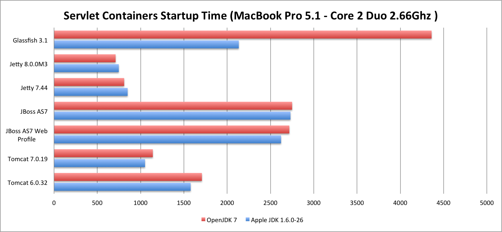

+++
title = 'Servlet Containers Startup Time'
date = 2011-07-15T13:20:23+02:00
draft = false
tags = [ 'JBoss', 'Jetty', 'OSX', 'Tomcat' ]
categories = [ 'Performance' ]
image = 'Startup6.png'
+++

With the release of JBoss AS7, we see many comments around about the startup time of Application Servers. Even if this appears marginal in real life (an application server is expected to run 24/24 7/7), there is area where startup time is still important like for developpers. In developpment phase, when you have to start/stop your server dozens of times by day, you need fastest start time as possible.

I conducted a very basic and simple test on my MacBook Pro, take various application servers and servlet containers and measure their startup time.

And in this days of Java 7 fever, try these servers with OpenJDK 7 (OS/X version).

### Results on MacBook Pro - Core2Duo 2.66Ghz

all time in millisecondes

### Remarks

- JBoss AS 6 (minimal profile) startup time was about 27s. I didn’t include it in graph to keep a good scale for others engines.
    
- JBoss AS6 seems to start well with OpenJDK 7 but was a bit long to stop, so I had to kill the process.
    
- JBoss AS7 web-profile and non certified full edition came with no webapp, so a bit less works at startup since no webapp has to be deployed and managed. Injecting a basic webapp take an extra 30ms on next starts.
    
- All servers performed pretty the same under Apple JDK 1.6.0-26 and OpenJDK 7.
    

### Conclusions

- Jetty is still the fastest container to start around.
    
- Apache Tomcat team does a good job on Apache Tomcat 7, near twice faster than Apache Tomcat 6 in startup time and not too far than Jetty.
    
- JBoss AS7 startup speed improvements are tremendous, about 13 times faster than its predecessor JBoss AS6, congrats guys !
    

Raw startup time data available [here](https://gist.github.com/3807564)