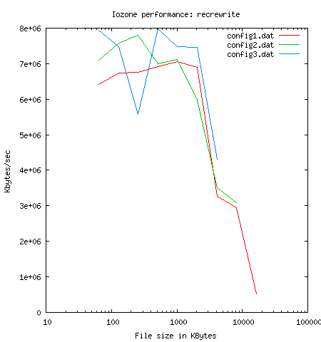
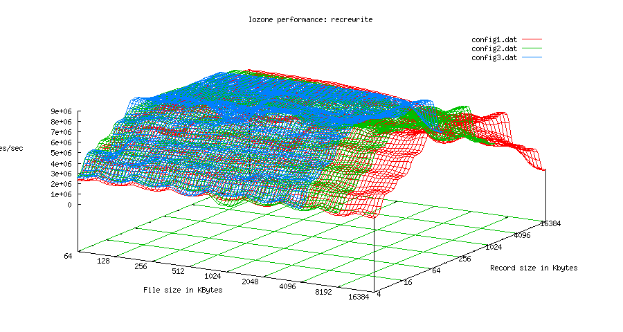

+++
title = 'Iozone and Gnuplot 4.x'
date = 2011-11-03T13:20:23+02:00
draft = false
tags = [ 'Gnuplot', 'Iozone' ]
categories = [ 'OS', 'Performance' ]
image = 'iozonegnuplot.png'
+++

[Iozone](http://www.iozone.org/) is a great tool to mesure performance of filesystem. You could find 10 examples [here](http://www.thegeekstuff.com/2011/05/iozone-examples/).

In it latest version, 3.97, it came with reporting tools, **report.pl** and **gengnuplot.sh**, who use gnuplot to render images.


Due to changes in GnuPlot 4.x, **report.pl** and **gnu3d.dem** need to be updated to works. Also you may get only **8 metrics** in reports instead of **15** expected in latest release of **report.pl**

## gnu3d.dem

```
#
# $Id: 3D plot of performance
#
# Processes files that were created by Generate_Graphs
# and displays the results. Also, saves a postscript copy.
#
# Don Capps

set terminal x11
set title "Iozone performance"
set grid lt 2 lw 1
set surface
set parametric
set xtics
set ytics
set logscale x 2
set logscale y 2
set autoscale z
#set xrange [2.**5:2.**24]
set xlabel "File size in 2^n KBytes"
set ylabel "Record size in 2^n Kbytes"
set zlabel "Kbytes/sec"
#set data style lines
set style data lines
set dgrid3d 80,80,3
splot 'write/iozone_gen_out.gnuplot' title "Write performance"
pause -1 "Hit return to continue"
set terminal postscript color
set output "write/write.ps"
splot 'write/iozone_gen_out.gnuplot' title "Write performance"

set terminal x11
set title "Iozone performance"
set grid lt 2 lw 1
set surface
set xtics
set ytics
set logscale x 2
set logscale y 2
set autoscale z
#set xrange [2.**5:2.**24]
set xlabel "File size in 2^n KBytes"
set ylabel "Record size in 2^n Kbytes"
set zlabel "Kbytes/sec"
#set data style lines
set style data lines
set dgrid3d 80,80,3
splot 'rewrite/iozone_gen_out.gnuplot' using 1:2:3 title "ReWrite performance" with lines
pause -1 "Hit return to continue"
set terminal postscript color
set output "rewrite/rewrite.ps"
splot 'rewrite/iozone_gen_out.gnuplot' using 1:2:3 title "ReWrite performance" with lines

set terminal x11
set title "Iozone performance"
set grid lt 2 lw 1
set surface
set xtics
set ytics
set logscale x 2
set logscale y 2
set autoscale z
#set xrange [2.**5:2.**24]
set xlabel "File size in 2^n KBytes"
set ylabel "Record size in 2^n Kbytes"
set zlabel "Kbytes/sec"
#set data style lines
set style data lines
set dgrid3d 80,80,3
splot 'read/iozone_gen_out.gnuplot' using 1:2:3 title "Read performance" with lines
pause -1 "Hit return to continue"
set terminal postscript color
set output "read/read.ps"
splot 'read/iozone_gen_out.gnuplot' using 1:2:3 title "Read performance" with lines


set terminal x11
set title "Iozone performance"
set grid lt 2 lw 1
set surface
set xtics
set ytics
set logscale x 2
set logscale y 2
set autoscale z
#set xrange [2.**5:2.**24]
set xlabel "File size in 2^n KBytes"
set ylabel "Record size in 2^n Kbytes"
set zlabel "Kbytes/sec"
#set data style lines
set style data lines
set dgrid3d 80,80,3
splot 'reread/iozone_gen_out.gnuplot' using 1:2:3 title "Reread performance" with lines
pause -1 "Hit return to continue"
set terminal postscript color
set output "reread/reread.ps"
splot 'reread/iozone_gen_out.gnuplot' using 1:2:3 title "Reread performance" with lines

set terminal x11
set title "Iozone performance"
set grid lt 2 lw 1
set surface
set xtics
set ytics
set logscale x 2
set logscale y 2
set autoscale z
#set xrange [2.**5:2.**24]
set xlabel "File size in 2^n KBytes"
set ylabel "Record size in 2^n Kbytes"
set zlabel "Kbytes/sec"
#set data style lines
set style data lines
set dgrid3d 80,80,3
splot 'randread/iozone_gen_out.gnuplot' using 1:2:3 title "Random read performance" with lines
pause -1 "Hit return to continue"
set terminal postscript color
set output "randread/randread.ps"
splot 'randread/iozone_gen_out.gnuplot' using 1:2:3 title "Random read performance" with lines

set terminal x11
set title "Iozone performance"
set grid lt 2 lw 1
set surface
set xtics
set ytics
set logscale x 2
set logscale y 2
set autoscale z
#set xrange [2.**5:2.**24]
set xlabel "File size in 2^n KBytes"
set ylabel "Record size in 2^n Kbytes"
set zlabel "Kbytes/sec"
#set data style lines
set style data lines
set dgrid3d 80,80,3
splot 'randwrite/iozone_gen_out.gnuplot' using 1:2:3 title "Random write performance" with lines
pause -1 "Hit return to continue"
set terminal postscript color
set output "randwrite/randwrite.ps"
splot 'randwrite/iozone_gen_out.gnuplot' using 1:2:3 title "Random write performance" with lines

set terminal x11
set title "Iozone performance"
set grid lt 2 lw 1
set surface
set xtics
set ytics
set logscale x 2
set logscale y 2
set autoscale z
#set xrange [2.**5:2.**24]
set xlabel "File size in 2^n KBytes"
set ylabel "Record size in 2^n Kbytes"
set zlabel "Kbytes/sec"
#set data style lines
set style data lines
set dgrid3d 80,80,3
splot 'bkwdread/iozone_gen_out.gnuplot' using 1:2:3 title "Read Backwards performance" with lines
pause -1 "Hit return to continue"
set terminal postscript color
set output "bkwdread/bkwdread.ps"
splot 'bkwdread/iozone_gen_out.gnuplot' using 1:2:3 title "Read Backwards performance" with lines

set terminal x11
set title "Iozone performance"
set grid lt 2 lw 1
set surface
set xtics
set ytics
set logscale x 2
set logscale y 2
set autoscale z
#set xrange [2.**5:2.**24]
set xlabel "File size in 2^n KBytes"
set ylabel "Record size in 2^n Kbytes"
set zlabel "Kbytes/sec"
#set data style lines
set style data lines
set dgrid3d 80,80,3
splot 'recrewrite/iozone_gen_out.gnuplot' using 1:2:3 title "Record rewrite performance" with lines
pause -1 "Hit return to continue"
set terminal postscript color
set output "recrewrite/recrewrite.ps"
splot 'recrewrite/iozone_gen_out.gnuplot' using 1:2:3 title "Record rewrite performance" with lines

set terminal x11
set title "Iozone performance"
set grid lt 2 lw 1
set surface
set xtics
set ytics
set logscale x 2
set logscale y 2
set autoscale z
#set xrange [2.**5:2.**24]
set xlabel "File size in 2^n KBytes"
set ylabel "Record size in 2^n Kbytes"
set zlabel "Kbytes/sec"
#set data style lines
set style data lines
set dgrid3d 80,80,3
splot 'strideread/iozone_gen_out.gnuplot' using 1:2:3 title "Stride read performance" with lines
pause -1 "Hit return to continue"
set terminal postscript color
set output "strideread/strideread.ps"
splot 'strideread/iozone_gen_out.gnuplot' using 1:2:3 title "Stride read performance" with lines

set terminal x11
set title "Iozone performance"
set grid lt 2 lw 1
set surface
set xtics
set ytics
set logscale x 2
set logscale y 2
set autoscale z
#set xrange [2.**5:2.**24]
set xlabel "File size in 2^n KBytes"
set ylabel "Record size in 2^n Kbytes"
set zlabel "Kbytes/sec"
#set data style lines
set style data lines
set dgrid3d 80,80,3
splot 'fwrite/iozone_gen_out.gnuplot' using 1:2:3 title "Fwrite performance" with lines
pause -1 "Hit return to continue"
set terminal postscript color
set output "fwrite/fwrite.ps"
splot 'fwrite/iozone_gen_out.gnuplot' using 1:2:3 title "Fwrite performance" with lines

set terminal x11
set title "Iozone performance"
set grid lt 2 lw 1
set surface
set xtics
set ytics
set logscale x 2
set logscale y 2
set autoscale z
#set xrange [2.**5:2.**24]
set xlabel "File size in 2^n KBytes"
set ylabel "Record size in 2^n Kbytes"
set zlabel "Kbytes/sec"
#set data style lines
set style data lines
set dgrid3d 80,80,3
splot 'frewrite/iozone_gen_out.gnuplot' using 1:2:3 title "Frewrite performance" with lines
pause -1 "Hit return to continue"
set terminal postscript color
set output "frewrite/frewrite.ps"
splot 'frewrite/iozone_gen_out.gnuplot' using 1:2:3 title "Frewrite performance" with lines

set terminal x11
set title "Iozone performance"
set grid lt 2 lw 1
set surface
set xtics
set ytics
set logscale x 2
set logscale y 2
set autoscale z
#set xrange [2.**5:2.**24]
set xlabel "File size in 2^n KBytes"
set ylabel "Record size in 2^n Kbytes"
set zlabel "Kbytes/sec"
#set data style lines
set style data lines
set dgrid3d 80,80,3
splot 'fread/iozone_gen_out.gnuplot' using 1:2:3 title "Fread performance" with lines
pause -1 "Hit return to continue"
set terminal postscript color
set output "fread/fread.ps"
splot 'fread/iozone_gen_out.gnuplot' using 1:2:3 title "Fread performance" with lines

set terminal x11
set title "Iozone performance"
set grid lt 2 lw 1
set surface
set xtics
set ytics
set logscale x 2
set logscale y 2
set autoscale z
#set xrange [2.**5:2.**24]
set xlabel "File size in 2^n KBytes"
set ylabel "Record size in 2^n Kbytes"
set zlabel "Kbytes/sec"
#set data style lines
set style data lines
set dgrid3d 80,80,3
splot 'freread/iozone_gen_out.gnuplot' using 1:2:3 title "Freread performance" with lines
pause -1 "Hit return to exit"
set terminal postscript color
set output "freread/freread.ps"
splot 'freread/iozone_gen_out.gnuplot' using 1:2:3 title "Freread performance" with lines
```

## report.pl

```
#!/usr/bin/perl
#
# arguments: one of more report files
#
# Christian Mautner <christian * mautner . ca>, 2005-10-31
#
# This script is based loosely on the Generate_Graph set
# of scripts that come with iozone, but is a complete re-write
#
# The main reason to write this was the need to compare the behaviour of
# two or more different setups, for tuning filesystems or 
# comparing different pieces of hardware.
#
# This script is in the public domain, too short and too trivial
# to deserve a copyright.
#
# Simply run iozone like, for example, ./iozone -a -g 4G > config1.out (if your machine has 4GB)
# and then run perl report.pl config1.out
# or get another report from another box into config2.out and run
# perl report.pl config1.out config2.out
# the look in the report_* directory for .png
#
# If you don't like png or the graphic size, search for "set terminal" in this file and put whatever gnuplot
# terminal you want. Note I've also noticed that gnuplot switched the set terminal png syntax
# a while back, you might need "set terminal png small size 900,700"
#


@Reports=@ARGV;

die "usage: $0 <iozone.out> [<iozone2.out>...]\n" if not @Reports or grep (m|^-|, @Reports);

die "report files must be in current directory" if grep (m|/|, @Reports);

%columns=(
         'write'     =>3,
         'read'      =>5,
         'rewrite'   =>4,
         'reread'    =>6,
         'randread'  =>7,
         'randwrite' =>8,
         'bkwdread'  =>9,
         'recrewrite'=>10,
         'strideread'=>11,
         'fwrite'    =>12,
         'frewrite'  =>13,
         'fread'     =>14,
         'freread'   =>15,
         );

#
# create output directory. the name is the concatenation
# of all report file names (minus the file extension, plus
# prefix report_)
#
$outdir="report_".join("_",map{/([^\.]+)(\..*)?/ && $1}(@Reports));

print STDERR "Output directory: $outdir ";

if ( -d $outdir )
{
    print STDERR "(removing old directory) ";
    system "rm -rf $outdir";
}

mkdir $outdir or die "cannot make directory $outdir";

print STDERR "done.\nPreparing data files...";

foreach $report (@Reports)
{
    open(I, $report) or die "cannot open $report for reading";
    $report=~/^([^\.]+)/;
    $datafile="$1.dat";
    push @datafiles, $datafile;
    open(O, ">$outdir/$datafile") or die "cannot open $outdir/$datafile for writing";
    open(O2, ">$outdir/2d-$datafile") or die "cannot open $outdir/$datafile for writing";
    while(<I>)
    {
        next unless ( /^[\s\d]+$/ );
        @split = split();
        # We may have only 7 metrics (no block entries). Replaced == 15 with >=8
        next unless ( @split >= 8 );
        print O;
        print O2 if $split[1] == 16384 or $split[0] == $split[1];
    }
    close I, O, O2;
}

print STDERR "done.\nGenerating graphs:";

foreach $column (keys %columns)
{
    print STDERR " $column";

    open(G, ">$outdir/$column.do") or die "cannot open $outdir/$column.do for writing";
    print G qq{
set title "Iozone performance: $column"
set grid lt 2 lw 1
set surface
set parametric
set xtics
set ytics
set logscale x 2
set logscale y 2
set autoscale z
#set xrange [2.**5:2.**24]
set xlabel "File size in KBytes"
set ylabel "Record size in Kbytes"
set zlabel "Kbytes/sec"
#set data style lines
set style data lines
set dgrid3d 80,80,3
#set terminal png small picsize 900 700
set terminal png small size 900 700
set output "$column.png"
};

    print G "splot ". join(", ", map{qq{"$_" using 1:2:$columns{$column} title "$_"}}(@datafiles));

    print G "\n";

    close G;

    open(G, ">$outdir/2d-$column.do") or die "cannot open $outdir/$column.do for writing";
    print G qq{
set title "Iozone performance: $column"
#set terminal png small picsize 450 350
set terminal png small size 450 350
set logscale x
set xlabel "File size in KBytes"
set ylabel "Kbytes/sec"
set output "2d-$column.png"
};

    print G "plot ". join(", ", map{qq{"2d-$_" using 1:$columns{$column} title "$_" with lines}}(@datafiles));

    print G "\n";

    close G;

    if ( system("cd $outdir && gnuplot $column.do && gnuplot 2d-$column.do") )
    {
        print STDERR "(failed) ";
    }
    else
    {
        print STDERR "(ok) ";
    }
}

print STDERR "done.\n";
```