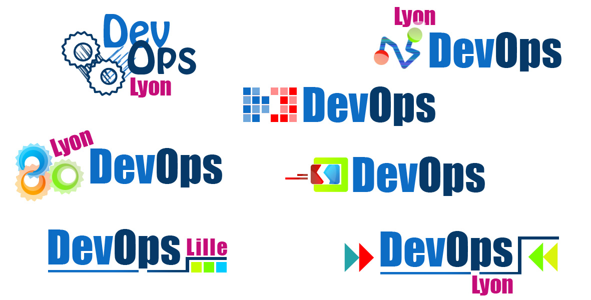

+++
title = 'DevOps Logo'
date = 2012-02-08T13:20:23+02:00
draft = false
tags = [ 'DevOps', 'Logo' ]
categories = [ 'Opensource' ]
image = 'logo_devops2.jpg'
+++

I asked some times ago Sabrina Perrin (@saabpii) a great graphic designer I worked with for years, if she could try to works on some DevOps logo.

As expected she has been very motivated and inspired.

Here are the results :

Now I need you to comments and votes for them.

All of this artwork is free to use, just mention Sabrina somewhere on your sites/blogs/presentations.

Thanks again Sabrina !