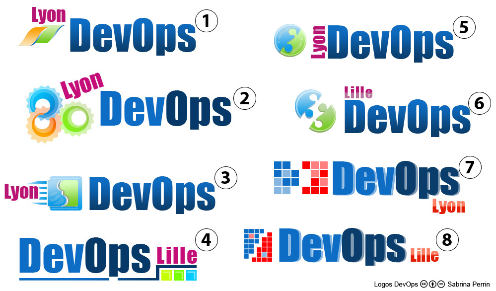

+++
title = 'DevOps Logo - 2nd Try'
date = 2012-02-20T13:20:23+02:00
draft = false
tags = [ 'DevOps', 'Logo' ]
categories = [ 'Opensource' ]
image = 'logo_devops_v2.jpg'
+++

Here is the second try of logos for DevOps, still provided by Sabrina (@saabpii). She carefully tracked comments here and on Twitter :

Please vote for your preferred one.
