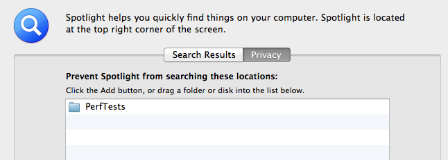
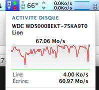

+++
title = 'To SSD or Not To SSD'
date = 2012-03-18T13:20:23+02:00
draft = false
tags = [ 'Benchmarks', 'SSD' ]
categories = [ 'Performance' ]
image = 'ssds.png'
+++

My MacBookPro is quite old now :

- MacBook Pro 5.1 (Late 2008)
- Core2Duo 2.66Ghz

Under Lion, MBP appears to be sometime laggy even if I already updated it :

- Replaced original 4Gb RAM to 8Gb DDR3 (GSkill PC8500 SQ (1066 MHz), 7-7-7-20)
- Replaced original Hitachi 320GB/5400 RPM by a 500Gb WesternDigital Black Black 7200RPM (WD5000BEKT-75KA9T0)

I run [GeekBench 2.2.7](http://www.primatelabs.ca/geekbench/) and give me a bench result of **3752** :

```
Benchmark Summary
  Integer Score              3123 |
  Floating Point Score       5493 |
  Memory Score               2629 |
  Stream Score               2110 |

  Geekbench Score            3752 |

System Information
  Operating System      Mac OS X 10.7.3 (Build 11D50)
  Model                 MacBook Pro (Late 2008)
  Motherboard           Apple Inc. Mac-F42D86A9 Proto
  Processor             Intel Core 2 Duo T9550 @ 2.66 GHz
                        1 Processor, 2 Cores, 2 Threads
  Processor ID          GenuineIntel Family 6 Model 23 Stepping 10
  L1 Instruction Cache  32.0 KB x 2
  L1 Data Cache         32.0 KB x 2
  L2 Cache              6.00 MB
  L3 Cache              0.00 B
  Memory                8.00 GB 1067 MHz DDR3
  BIOS                  Apple Inc.    MBP51.88Z.007E.B06.1202061253
```

IOs seems to be the limiting factor, especially when I’m using VirtualBox, I feel a slow IO performances.

## Time to bench IOs

There is no tools like ****HD Tune**** on OSX, so I wrote a very simple shell script to measure raw IO performances.

```
#!/bin/sh
COUNT=2048

echo "testing pseudo-IO performances - 1st Pass"
dd if=/dev/zero of=/dev/null bs=1m count=$COUNT

echo "testing IO write performances - 1st Pass"
dd if=/dev/zero of=PERFTEST bs=1m count=$COUNT

echo "testing IO read performances - 1st Pass"
dd if=PERFTEST of=/dev/null bs=1m count=$COUNT

echo "testing IO read performances - 2nd Pass"
dd if=PERFTEST of=/dev/null bs=1m count=$COUNT

echo "testing IO write performances - 2nd Pass"
dd if=/dev/zero of=PERFTEST bs=1m count=$COUNT
```

Results :

```
testing pseudo-IO performances - 1st Pass
2048+0 records in
2048+0 records out
2147483648 bytes transferred in 0.225590 secs (9519410157 bytes/sec)
testing IO write performances - 1st Pass
2048+0 records in
2048+0 records out
2147483648 bytes transferred in 29.882202 secs (71864973 bytes/sec)
testing IO read performances - 1st Pass
2048+0 records in
2048+0 records out
2147483648 bytes transferred in 0.677308 secs (3170615711 bytes/sec)
testing IO read performances - 2nd Pass
2048+0 records in
2048+0 records out
2147483648 bytes transferred in 0.675835 secs (3177527036 bytes/sec)
testing IO write performances - 2nd Pass
2048+0 records in
2048+0 records out
2147483648 bytes transferred in 33.203725 secs (64675986 bytes/sec)
```

Note, I run this performance tests from a directory excluded from Spotlight indexing !



- Pseudo IO performance is justing virtual IO (/dev/zero and /dev/null), so it provide max raw IO performance : **9078 MB/s**
    
- Write IO performance is between **61** and **68 MB/s**
    
- Read IO performance is very high with **3023 MB/s**
    

I replayed script raising COUNT from **2048** to **20480** to reduce OSX ram buffer impact in Read IO performance but still get about **2000 MB/s**

### iStat Menu disk activity - Write Performance


## Conclusions

- WD Black Edition perform pretty well on raw sequential Read Operations
    
- With its average **63 MB/s** raw sequential Write Operations, WD is about 7 time slower than faster SSD like **OCZ Vertex 3**
    

Is it time to update MBP to SSD ? Probably and my candidates are :

- Crucial M4 128GB. This SSD is reported very stable and reliable. Bonus, its firmware could be updated from Mac.
    
- OCZ Vertex 3 120GB. This SSD is top performer in benchmarks but Googling it reports many reliability problems.
    

I’d like to get feedback from you, performing same performance testing on your Mac hardware (MBP/ SSD configurations very welcomed).