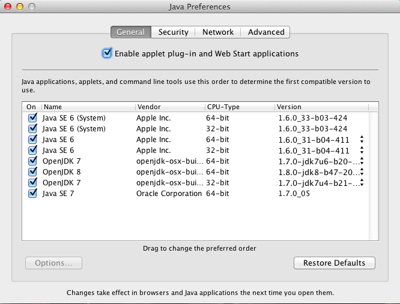

+++
title = 'Understanding Java From Command Line on OSX'
date = 2012-07-20T13:20:23+02:00
draft = false
tags = [ 'Java', 'OSX' ]
categories = [ 'OS' ]
image = 'osxclijava.png'
+++
# Java on OSX

OSX is a good platform for Java development but also running Java applications. Sadly XServe servers are no more available but in many cases Mac Mini could to pretty good works as Java server applications.

For a long time, OSX Java was maintained by Apple, from Sun Hotspot and was often a bit late vs Windows/Linux releases.

With Lion, Apple announced that they won’t produce Java for their futures OS, starting with Mountain Lion (10.8) and Oracle will do the job as they did for major distributions.

OpenJDK project included OSX support more than one year ago and there is now a very good coverage of Java for OSX.

It take some time to see first official Java 7 from Oracle on OSX, for Lion only, but there was community alternatives like [openjdk-osx-build](http://code.google.com/p/openjdk-osx-build/), where you could find a large choice of OpenJDK for OSX (7, 8, 8 with Lambda, 8 with Jigsaw).

If you install Java’s from [Oracle](http://www.oracle.com/technetwork/java/javase/downloads/index.html) or [openjdk-osx-build](http://code.google.com/p/openjdk-osx-build/downloads/list), you may want to know how to select one of them for your application and even select a specific one for some of your applications.

# Java Preferences

Apple provide a good tool to select default JVM, Java Preferences :



In this screenshot you could see many JVM, from many sources, **Apple, Oracle** and **openjdk-osx-build** and default ordering Java (from up to bottom).

Here you’ll see that default JVM will be Apple Java 1.6.0_33-b03-424 in 64bits, next choice will be Apple Java 1.6.0_33-b03-424 in 32bits. You will notice these JVM are marked as System, more on this later.

Next you’ll find Apple Java 1.6.0_31 in 64 and 32 bits and then Java 1.7 (1.7.0-jdk7u6-b20-20120719) from openjdk-osx-build. By the end you’ll find latest official Oracle Java 7, aka 1.7.0_05.

What does it means for you in a command line mode, console is just mandatory for any serious OSX geek ?

Let see java used by default :

```
mbp-rico:~ henri$ java -version
java version "1.6.0_33"
Java(TM) SE Runtime Environment (build 1.6.0_33-b03-424-11M3720)
Java HotSpot(TM) 64-Bit Server VM (build 20.8-b03-424, mixed mode)
```

Default Java is Apple 1.6.0_33, 64bits as expected, so far so good.

What should i do if I want to select instead Java 7 ?

## Standard Unix way

You could just update your PATH environment variable to update search path :

```
mbp-rico:~ henri$ export PATH=/Library/Java/JavaVirtualMachines/1.7.0u6.jdk/Contents/Home/bin:$PATH
mbp-rico:~ henri$ java -version
openjdk version "1.7.0-jdk7u6-b20"
OpenJDK Runtime Environment (build 1.7.0-jdk7u6-b20-20120719)
OpenJDK 64-Bit Server VM (build 23.2-b09, mixed mode)
```

It works but OSX provide smarter mechanism.

## OSX way

Keeping in mind we’re discussing command line operation, updating default JVM via Java Preferences will not be retained, will define instead **JAVA_HOME** environment variable like this :

```
mbp-rico:~ henri$ export JAVA_HOME=/Library/Java/JavaVirtualMachines/1.7.0u6.jdk/Contents/Home/
mbp-rico:~ henri$ java -version
openjdk version "1.7.0-jdk7u6-b20"
OpenJDK Runtime Environment (build 1.7.0-jdk7u6-b20-20120719)
OpenJDK 64-Bit Server VM (build 23.2-b09, mixed mode)
```

We could keep our current PATH and it will be **Apple java bootstrap** system, living into **/usr/bin/java** who make use of **JAVA_HOME** and launch the proper JVM. Simple but efficient .

## java_home

As we see previously, Java Preferences define an order of preferred JVM on OSX, like alternatives does on many Linux systems, especially those using [JPackage](http://www.jpackage.org/) tooling. So there should be a way to get access to these preferences and here entering **java_home**

java_home is located in /usr/libexec and has many useful features :

```
mbp-rico:~ henri$ /usr/libexec/java_home --help
Usage: java_home [options...]
    Returns the path to a Java home directory from the current user's settings.

Options:
    [-v/--version   <version>]       Filter Java versions in the "JVMVersion" form 1.X(+ or *).
    [-a/--arch      <architecture>]  Filter JVMs matching architecture (i386, x86_64, etc).
    [-d/--datamodel <datamodel>]     Filter JVMs capable of -d32 or -d64
    [-t/--task      <task>]          Use the JVM list for a specific task (Applets, WebStart, BundledApp, JNI, or CommandLine)
    [-F/--failfast]                  Fail when filters return no JVMs, do not continue with default.
    [   --exec      <command> ...]   Execute the $JAVA_HOME/bin/<command> with the remaining arguments.
    [-R/--request]                   Request installation of a Java Runtime if not installed.
    [-X/--xml]                       Print full JVM list and additional data as XML plist.
    [-V/--verbose]                   Print full JVM list with architectures.
    [-h/--help]                      This usage information.
```

Let’s play with **java_home** now.

Obtaining path of default JVM :

```
mbp-rico:~ henri$ /usr/libexec/java_home
/System/Library/Java/JavaVirtualMachines/1.6.0.jdk/Contents/Home
```

Obtaining path of default Java 7 JVM :

```
mbp-rico:~ henri$ /usr/libexec/java_home -v 1.7
/Library/Java/JavaVirtualMachines/1.7.0u6.jdk/Contents/Home
```

Obtaining path of default Java 8 JVM :

```
mbp-rico:~ henri$ /usr/libexec/java_home -v 1.8
/Library/Java/JavaVirtualMachines/1.8.0.jdk/Contents/Home
```

Obtaining path of default Java 1.6 32 bits JVM :

```
mbp-rico:~ henri$ /usr/libexec/java_home -v 1.6 -a i386
/System/Library/Java/JavaVirtualMachines/1.6.0.jdk/Contents/Home
```

Obtaining path of default Java 1.6 64 bits JVM :

```
mbp-rico:~ henri$ /usr/libexec/java_home -v 1.6 -a x86_64
/System/Library/Java/JavaVirtualMachines/1.6.0.jdk/Contents/Home
```

Here you could see that 32 and 64bits JVM have the same path. This is because due to universal mode (i386/x86_64), **Apple** produce a dual mode JVM. This is not the case for **Oracle Java 7** where only 64bits JVM is available.

Let’s combine **java_home** and **JAVA_HOME** :

```
mbp-rico:~ henri$ export JAVA_HOME=`/usr/libexec/java_home -v 1.7`
mbp-rico:~ henri$ java -version
openjdk version "1.7.0-jdk7u6-b20"
OpenJDK Runtime Environment (build 1.7.0-jdk7u6-b20-20120719)
OpenJDK 64-Bit Server VM (build 23.2-b09, mixed mode)
```

This is a very nice features if you want to specify a Java Level (6 or 7) following your **Java Preferences** for some of your server side application (let say **Apache Tomcat**) or command operation (like **Apache Maven**).

Typically for my Apache Tomcat powered application like Jenkins, I usually set it in bin/setenv.sh :

```
export JAVA_HOME=`/usr/libexec/java_home -v 1.7`
CATALINA_OPTS=-Xms256m -Xmx512m -DJENKINS_HOME=$JENKINS_HOME -Dhudson.model.Hudson.logStartupPerformance=true -Duser.language=en -Djava.awt.headless=true
```

Do you want to get a list of all JVM on your system ?

```
mbp-rico:~ henri$ /usr/libexec/java_home -V
Matching Java Virtual Machines (33):
    1.6.0_33-b03-424, x86_64: "Java SE 6"   /System/Library/Java/JavaVirtualMachines/1.6.0.jdk/Contents/Home
    1.6.0_33-b03-424, i386:   "Java SE 6"   /System/Library/Java/JavaVirtualMachines/1.6.0.jdk/Contents/Home
    1.6.0_31-b04-411, x86_64: "Java SE 6"   /Library/Java/JavaVirtualMachines/1.6.0_31-b04-411.jdk/Contents/Home
    1.6.0_31-b04-411, i386:   "Java SE 6"   /Library/Java/JavaVirtualMachines/1.6.0_31-b04-411.jdk/Contents/Home
    1.7.0-jdk7u6-b20-20120719, x86_64:    "OpenJDK 7"   /Library/Java/JavaVirtualMachines/1.7.0u6.jdk/Contents/Home
    1.8.0-jdk8-b47-20120720, x86_64:  "OpenJDK 8"   /Library/Java/JavaVirtualMachines/1.8.0.jdk/Contents/Home
    1.7.0-jdk7u4-b21-20120427, i386:  "OpenJDK 7"   /Library/Java/JavaVirtualMachines/1.7.0u4.jdk/Contents/Home
    1.7.0_05, x86_64: "Java SE 7"   /Library/Java/JavaVirtualMachines/1.7.0.jdk/Contents/Home
    1.6.0_33-b03-424, x86_64: "Java SE 6"   /Library/Java/JavaVirtualMachines/1.6.0_33-b03-424.jdk/Contents/Home
    1.6.0_33-b03-424, i386:   "Java SE 6"   /Library/Java/JavaVirtualMachines/1.6.0_33-b03-424.jdk/Contents/Home
    1.8.0-jdk8-b45-20120713-jigsaw, x86_64:   "OpenJDK 8"   /Library/Java/JavaVirtualMachines/1.8.0-jigsaw.jdk/Contents/Home
    1.8.0-b48-20120720-lambda, x86_64:    "OpenJDK 8"   /Library/Java/JavaVirtualMachines/1.8.0-lambda.jdk/Contents/Home
    1.7.0-jdk7u6-b20-20120719, i386:  "OpenJDK 7"   /Library/Java/JavaVirtualMachines/1.7.0u6.jdk/Contents/Home
    1.7.0-jdk7u4-b21-20120427, x86_64:    "OpenJDK 7"   /Library/Java/JavaVirtualMachines/1.7.0u4.jdk/Contents/Home
    1.7.0-jdk7u4-b21-20120421, x86_64:    "OpenJDK 7"   /Library/Java/JavaVirtualMachines/1.7.0u4-64.jdk/Contents/Home
    1.7.0, x86_64:    "OpenJDK 7"   /Library/Java/JavaVirtualMachines/1.7.0u.jdk/Contents/Home
    1.7.0, i386:  "OpenJDK 7"   /Library/Java/JavaVirtualMachines/1.7.0u.jdk/Contents/Home
    1.6.0_32-b05-420, x86_64: "Java SE 6"   /Library/Java/JavaVirtualMachines/1.6.0_32-b05-420.jdk/Contents/Home
    1.6.0_32-b05-420, i386:   "Java SE 6"   /Library/Java/JavaVirtualMachines/1.6.0_32-b05-420.jdk/Contents/Home
    1.6.0_32-b05-417, x86_64: "Java SE 6"   /Library/Java/JavaVirtualMachines/1.6.0_32-b05-417.jdk/Contents/Home
    1.6.0_32-b05-417, i386:   "Java SE 6"   /Library/Java/JavaVirtualMachines/1.6.0_32-b05-417.jdk/Contents/Home
    1.6.0_31-b04-413, x86_64: "Java SE 6"   /Library/Java/JavaVirtualMachines/1.6.0_31-b04-413.jdk/Contents/Home
    1.6.0_31-b04-413, i386:   "Java SE 6"   /Library/Java/JavaVirtualMachines/1.6.0_31-b04-413.jdk/Contents/Home
    1.6.0_30-b12-409, x86_64: "Java SE 6"   /Library/Java/JavaVirtualMachines/1.6.0_30-b12-409.jdk/Contents/Home
    1.6.0_30-b12-409, i386:   "Java SE 6"   /Library/Java/JavaVirtualMachines/1.6.0_30-b12-409.jdk/Contents/Home
    1.6.0_30-b12-404, x86_64: "Java SE 6"   /Library/Java/JavaVirtualMachines/1.6.0_30-b12-404.jdk/Contents/Home
    1.6.0_30-b12-404, i386:   "Java SE 6"   /Library/Java/JavaVirtualMachines/1.6.0_30-b12-404.jdk/Contents/Home
    1.6.0_29-b11-397, x86_64: "Java SE 6"   /Library/Java/JavaVirtualMachines/1.6.0_29-b11-397.jdk/Contents/Home
    1.6.0_29-b11-397, i386:   "Java SE 6"   /Library/Java/JavaVirtualMachines/1.6.0_29-b11-397.jdk/Contents/Home
    1.6.0_27-b07-395, x86_64: "Java SE 6"   /Library/Java/JavaVirtualMachines/1.6.0_27-b07-395.jdk/Contents/Home
    1.6.0_27-b07-395, i386:   "Java SE 6"   /Library/Java/JavaVirtualMachines/1.6.0_27-b07-395.jdk/Contents/Home
    1.6.0_26-b03-383, x86_64: "Java SE 6"   /Library/Java/JavaVirtualMachines/1.6.0_26-b03-383.jdk/Contents/Home
    1.6.0_26-b03-383, i386:   "Java SE 6"   /Library/Java/JavaVirtualMachines/1.6.0_26-b03-383.jdk/Contents/Home

/System/Library/Java/JavaVirtualMachines/1.6.0.jdk/Contents/Home
```
## Note on JVM Locations

You may have noticed many differents paths for JVM :

- /System/Library/Java/JavaVirtualMachines is where Apple install System JVM. Here you could have only one JVM by family, ie 1.6, 1.7. These JVM will be available to all users on system.
    
- /Library/Java/JavaVirtualMachines is a slot location for guest JVMs, specially designed to host contributors JVM like **Oracle**, **openjdk-osx-build** or **Apple Developper Preview JVMs** Also, these JVM will be available to all users on system.
    
- /Users/bill/Library/Java/JavaVirtualMachines is a slot for contributor JVMs but only available to user bill.
    

## To conclude

OSX is probably the platform with the more choice of Java to run and experiment, Java 6, Java 7, OpenJDK 7, 8, Lambda, Jigsaw.

And with its **/usr/libexec/java_home** and **JAVA_HOME** environment variable, you could select any of them for your console or command mode operations very easily.

Enjoy Java on OSX !