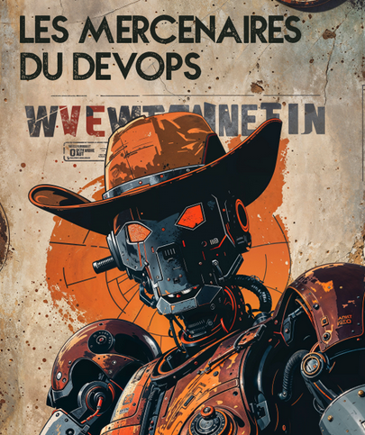

+++
title = 'Devoxx France 2024'
date = 2024-04-24T13:20:23+02:00
draft = false
tags = [ 'DevOps', 'Talk', 'DevoxxFrance' ]
categories = [ 'Conference' ]
image = 'devoxx-france-2024.jpg'
+++

**A Decade of DevOps: A Retrospective and Look to the Future**

**Introduction:**

A decade ago, in 2013, five of us stood on the Devoxx France stage to discuss an emerging topic: DevOps. As the "DevOps Mercenaries" - Dimitri Baeli, Arnaud Héritier, Pierre Antoine Grégoire, Gildas Cuisinier, and myself - we led a 3-hour workshop using a real-world case study of an ephemeral content transfer application. We demonstrated how to implement this project within a DevOps context.

Over the next two years, we returned to Devoxx France to host roundtables on DevOps, adopting a "bring your questions and let's discuss together" format. This approach was well-received, and many friends and colleagues have mentioned it to me recently.

DevOps has since become widely adopted in our industry in many forms. It seemed fitting, ten years later, to revisit this topic using a three-part roundtable format:

- **The Past:** A retrospective of 10 years of DevOps, what we've learned, the gains, and the shortcomings.
    
- **The Present:** Drawing on 10 years of DevOps, how to approach current trends like SRE and Platform Engineering, which are its inheritors. A particular focus on potential pitfalls.
    
- **The Future:** In an increasingly complex context of climate, geopolitics, technology, and AI, how to project ourselves onto what the future of the DevOps initiative might be, keeping in mind what we have learned about the original initiative and its implementation.

The DevOps Mercs did 3 sessions in Devoxx France 2024

* [Past](https://www.devoxx.fr/schedule/talk/?id=44947)
* [Present](https://www.devoxx.fr/schedule/talk/?id=74361) : 
* [Futur](https://www.devoxx.fr/schedule/talk/?id=74362)

Joining us for this exciting roundtable are esteemed experts in their respective fields:

- **DevOps:** Katia Himeur (CockpitIO)
    
- **GreenIT:** Morgane Eckert (Wescale)
    
- **Observability:** Cyrille LeClerc (Grafanalabs)
    
- **Sovereignty:** Quentin Adam (CleverCloud)
    
- **Platform Engineering:** Theotime Leveque (BackMarket)
