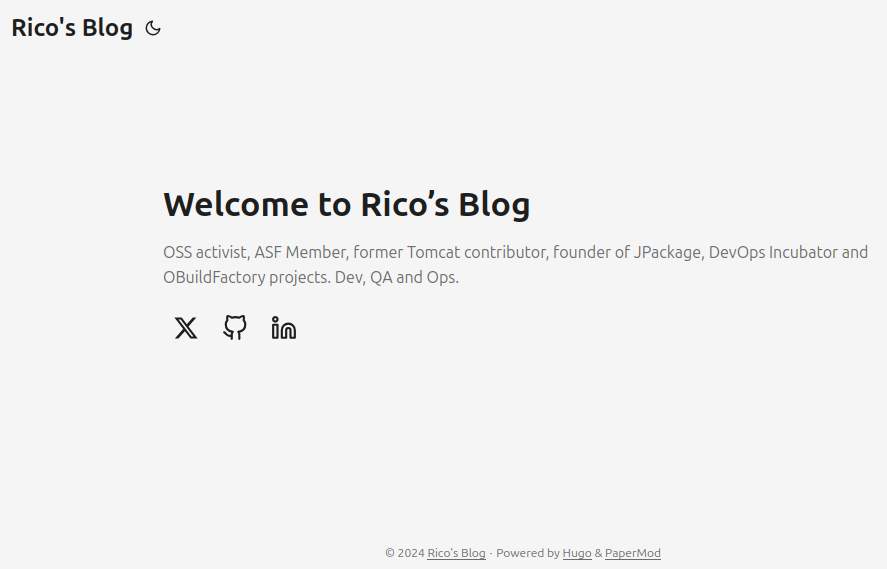

+++
title = 'New Blog using Hugo'
date = 2024-07-02T13:20:23+02:00
draft = false
tags = [ 'asdf', 'Hugo' ]
image = 'hugo-logo-wide.svg'
categories = [ 'Blog' ]
+++

At first, my blog was hosted on WordPress.

There were so many attack attempts on the WordPress-powered sites I worked on that I decided to move to something simpler, [Octopress](http://octopress.org/).

Incidentally, Octopress reached End of Life in 2015, so I had to move to something else. I chose [HubPress](https://github.com/HubPress), which unfortunately stopped development in 2019.

For a few years, my blog was waiting for a new engine. Then came [Hugo](https://gohugo.io/), a well-supported engine with a lot of plugins and themes. Additionally, Hugo integrates very simply with GitHub Pages via GitHub Actions.
## Install Hugo

I installed Hugo using the [asdf](https://asdf-vm.com/)

```
asdf plugin add hugo
asdf install hugo latest
asdf global hugo latest
```

Then I installed extended hugo

```
hugo version

hugo v0.128.0-e6d2712ee062321dc2fc49e963597dd5a6157660+extended linux/amd64 BuildDate=2024-06-25T16:15:48Z VendorInfo=gohugoio
```

Hugo being 0.128.0, install same extended version with asdf

```
asdf install hugo extended_0.128.0
asdf global hugo extended_0.128.0
```

## Blog Theme - PaperMode

There are a **really large number** of themes available for Hugo. I decided to choose something simple, [PaperMod](https://github.com/adityatelange/hugo-PaperMod).

I tried the latest released version, 7.0 (February 2023), but it didn't work as expected. So, I switched to the latest version in the master branch (something I always try to avoid).
 
```
mkdir Documents/Perso
hugo new site blog.hgomez.net
cd blog.hgomez.net
git init

# Grab latest PaperMod (get master as latest release 7.0 didn't works as expected)
curl -L https://github.com/adityatelange/hugo-PaperMod/archive/master.zip -Os
cd themes
unzip ../master.zip
mv hugo-PaperMod-master/ PaperMod
cd ..
# Housekeeping :)
rm -f master.zip
rm -f hugo.toml 
touch hugo.yaml
```

Default configuration, in hugo.yaml file
```title=hugo.yaml
baseURL: https://blog.hgomez.net/
languageCode: en-us
title: Rico's Blog
theme: ["PaperMod"]

enableEmoji: true

params:

  defaultTheme: auto

  homeInfoParams:
    Title: Welcome to Rico's Blog
    Content: OSS activist, ASF Member, former Tomcat contributor, founder of JPackage, DevOps Incubator and OBuildFactory projects. Dev, QA and Ops. 

  socialIcons: 
    - name: "X"
      url: "https://x.com/hgomez"
    - name: "GitHub"
      url: "https://github.com/hgomez/"
    - name: "LinkedIn"
      url: "https://fr.linkedin.com/in/gomezhe"

  ShowShareButtons: false
  ShowReadingTime: true
  ShowPostNavLinks: true
  ShowCodeCopyButtons: true

outputs:
  home:
    - HTML
    - RSS
    - JSON
EOF
```
## Let's have a look

```
hugo server
...

| EN
-------------------+-----
Pages | 10
Paginator pages | 0
Non-page files | 0
Static files | 1
Processed images | 0
Aliases | 1
Cleaned | 0

Built in 38 ms
Environment: "development"
Serving pages from disk
Running in Fast Render Mode. For full rebuilds on change: hugo server --disableFastRender
Web Server is available at http://localhost:1313/ (bind address 127.0.0.1)
Press Ctrl+C to stop
```



Quite promising so far 😉

In the next part, we'll explore how to migrate your content, publish your blog on GitHub Pages, and set up free website tracking without relying on Google Analytics.