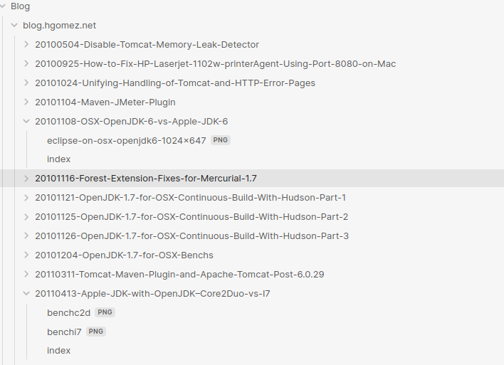
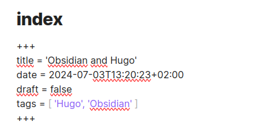
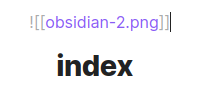
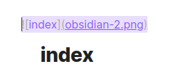

+++
title = 'Obsidian and Hugo'
date = 2024-07-03T03:20:23+02:00
draft = false
tags = [ 'Hugo', 'Obsidian' ]
image = '2023_Obsidian_logo.png'
categories = [ 'Blog' ]
+++

	
I've been using [Obsidian](https://obsidian.md/) for several months now to take my notes. It's an easy-to-use tool for writing in markdown mode, and it's very simple to insert images or links.

Obsidian organizes documentation into [Vaults](https://help.obsidian.md/Getting+started/Create+a+vault), which are simply folders. This makes it very easy to have the said content in a Git repository and thus have your notes shared on multiple devices, which is very practical when you want to switch from a personal computer to a professional one.

There is paid plans on Obsidian to [sync contents](https://obsidian.md/sync) on your devices and even [publish to the web](https://obsidian.md/publish) but this is not something I'm using right now, using git is enough for me.

[Hugo](https://gohugo.io/) is a blog engine using Markdown, there was obviously something to do to get blog contents produced via Obsidian.

It was quite simple.

1. I created a blog part inside Obsidian vault 
2. I copied old blogs contents by copy/pasting text and images.
3. One article is a directory, using my own convention YYYYMMDD-Title 
4. Inside the folder, an **index.md** and extra contents like images



Obsidian create a titlte.md file, so your title will be **index** and you enter the blog metadata contents as expected by Hugo


That's it! Your document now has the structure expected by Hugo. You can edit your file and, when finished, copy it to your Hugo directory.

For example:

- Obsidian blog content is hosted under `$HOME/Documents/Perso/Blog/blog.hgomez.net`
- Hugo blog is hosted under `$HOME/Documents/Perso/blog.hgomez.net`

In this case, you only need to copy your Obsidian blog content folder to the `content/post` directory in Hugo.

Here's the command:

```
cp -rf ~/Documents/Perso/obsidian-hgomez/Blog/blog.hgomez.net/* \
       ~/Documents/Perso/blog.hgomez.net/content/post/
```

With this structure, you have a working copy of your blog in Obsidian, while Hugo handles hosting elsewhere. This keeps your Obsidian and Hugo environments completely separate and allows them to have independent lifecycles.
### Side notes 

* Obsidian craft images links this way : 



* For Hugo, you should rework them the Markdown way



* Hugo won't generate pages where the date is set in the future. When editing your blog post dates, be sure to use a date in the past. 😇
