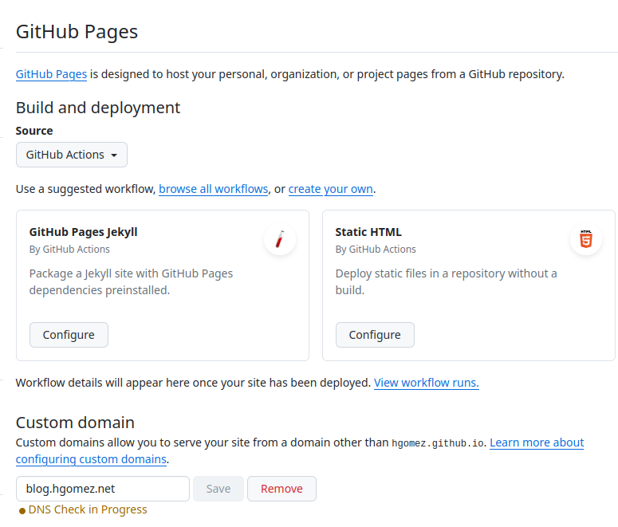
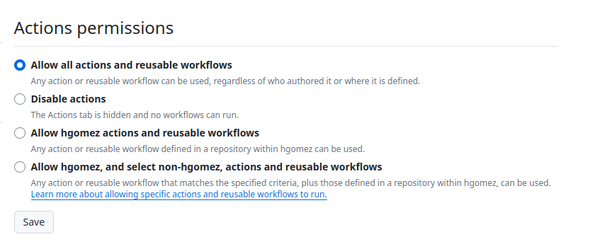

+++
title = 'Hugo and GitHub'
date = 2024-07-11T01:20:23+02:00
draft = false
tags = [ 'Hugo', 'GitHub' ]
image = 'hugo-love-github.png'
categories = [ 'Blog' ]
+++

My former blog was hosted on GitHub Pages and it was really easy to use Hugo there.

GitHub page was updated to use GitHub Actions

Using default GitHub Action 
