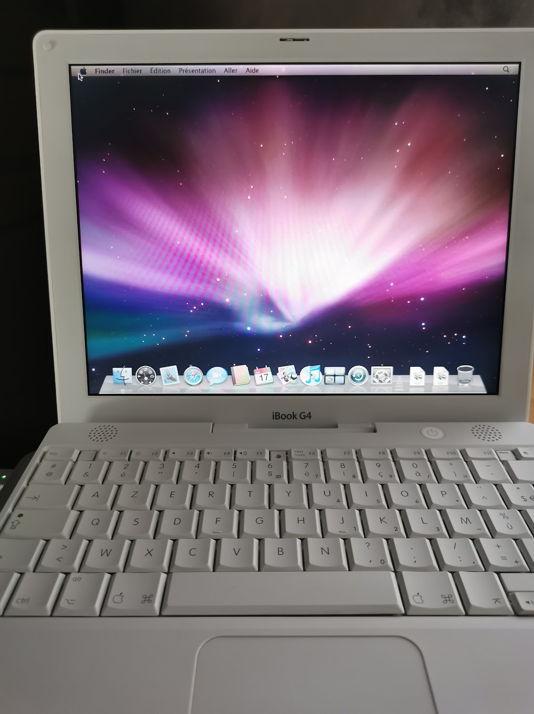
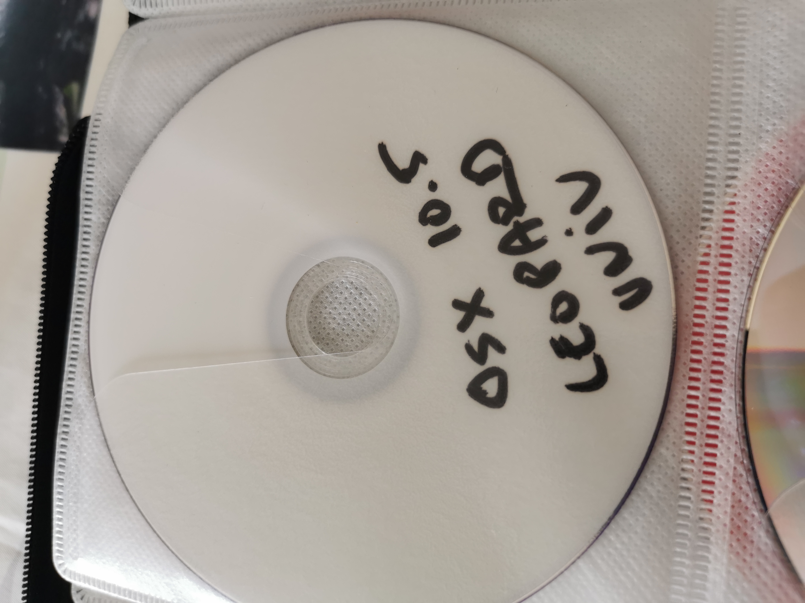
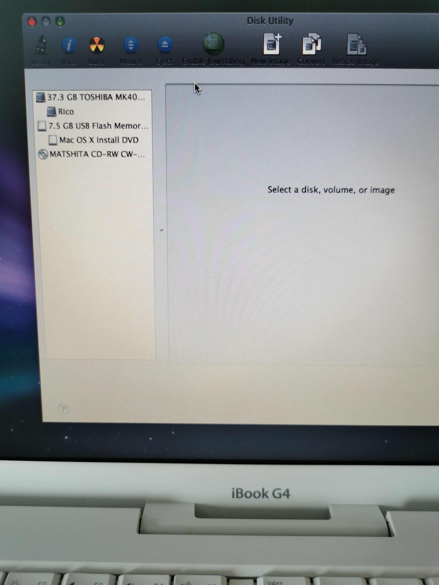
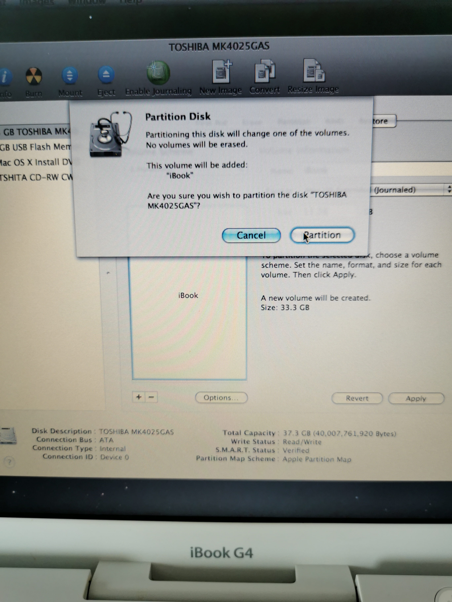
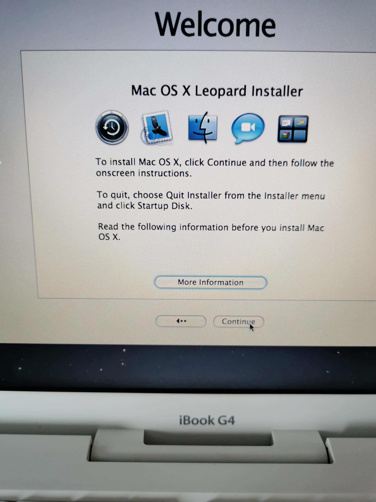
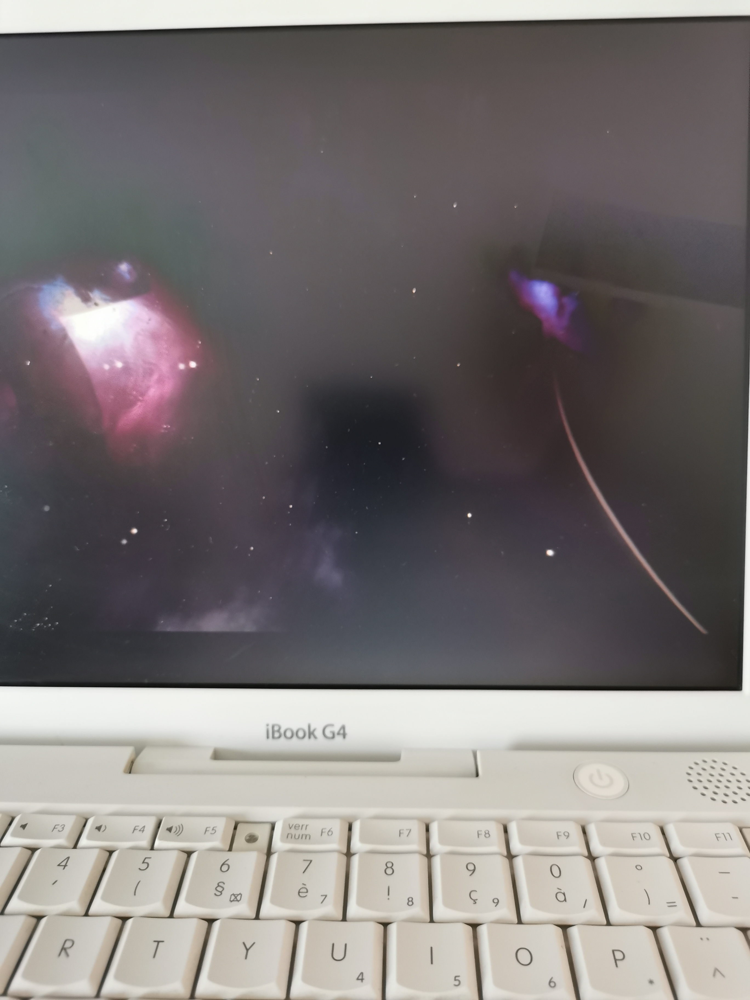
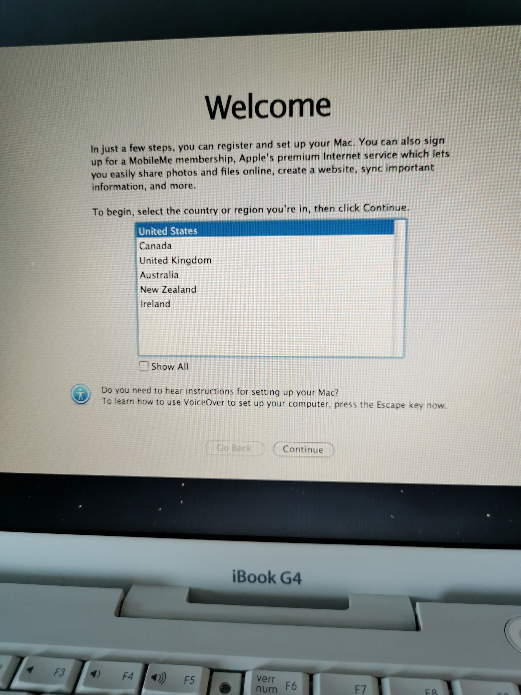
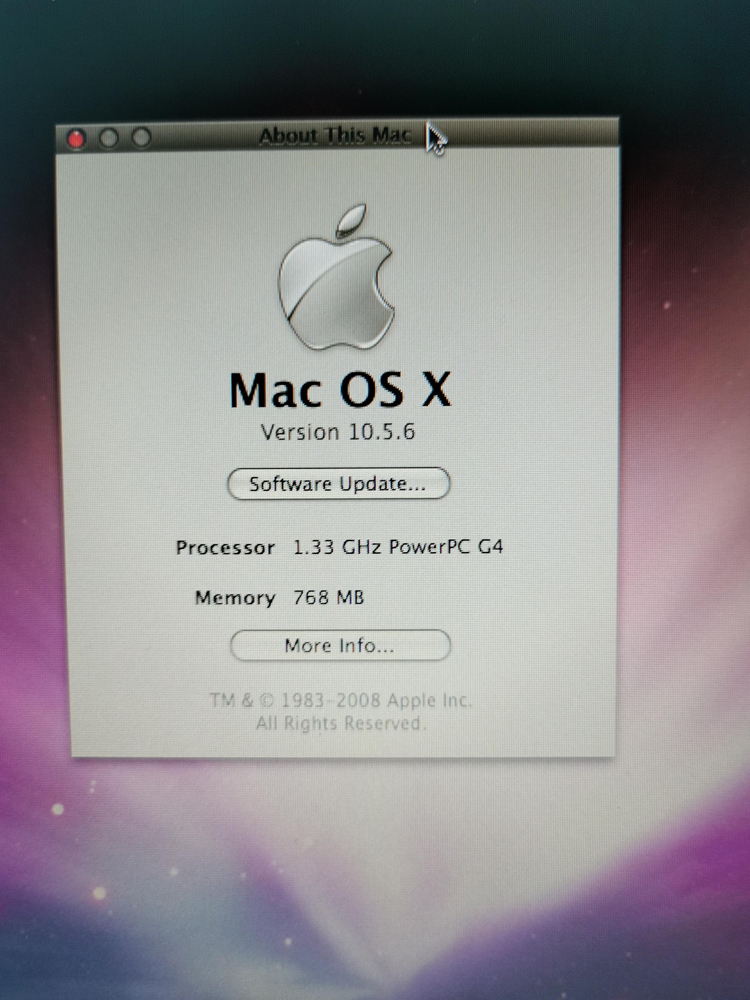

+++
title = 'iBook G4 Reinstallation'
date = 2024-07-16T20:20:23+02:00
draft = false
tags = [ 'Macintosh', 'Vintage' ]
image = 'ibookg4-title.png'
categories = [ 'Vintage' ]
+++

I recently received an old iBook G4 as a gift, and it's still in working order! This machine was the last PowerPC-based laptop Apple ever produced.

As a best practice, I always reinstall a clean operating system on any machine I refurbish.

This particular iBook G4 came pre-installed with OS X Tiger (10.4, released in 2005). It boasts a powerful PowerPC G4 processor clocked at 1.33 GHz, 512MB of RAM, and a spacious 40GB hard drive.

Since OS X Leopard (10.5, released in 2007) was the final version compatible with PowerPC machines, I opted for a fresh install of that version.

## Disk Utils, format and patatra

I had a working Tiger DVD, so I planned to boot from it, reformat the hard drive, and install OS X Leopard.

After booting, reformatting the hard drive, and initiating the OS X Leopard installation, the process stopped after a few minutes, and the iBook ultimately restarted. I attempted this process several times with the same negative outcome, even using a different Leopard DVD. Unfortunately, the installation consistently failed.

The iBook's DVD drive is likely malfunctioning and preventing a successful installation.

## Build a bootable USB with OSX Leopard 

Without Macintosh machines and working DVD drive, so I had look for Mac OSX Leopard image and found it on Archive.org, [Max OS X Leopard 10.5.6 (Retail ISO)](https://archive.org/details/mac-os-x-10.5.6-leopard-install-dvd)

I downloaded it on a Macintosh and used DIsk Utility to make a bootable USB
I used the [CLI way](https://www.cybrary.it/blog/macos-terminal-create-bootable-usb-iso-using-dd), with diskutil and dd.

## USB Boot via OpenFirmware

Early Apple machines based on PowerPC processors (1994-2006) lacked built-in support for booting from USB drives. However, a clever workaround existed through OpenFirmware as described [here](https://forums.macrumors.com/threads/guide-new-method-booting-from-usb-on-powerpc-macs.2403368/)

2 features of OpenFirmare will interest us, browsing USB and booting from USB.

### Browsing USB 

**dev** and **ls**, are the commands to select a device and list contents. I disconnected everything from the iBook and plugged an USB drive in first USB port (on the left)

I selected first usb

`dev usb0`

Then listed contents

`ls`

I found the drive on usb0 device, at disk@1

`ff9e3ba8: /disk@1`

### Booting from USB 

**probe-usb** is the command to boot from the USB drive

`probe-usb boot usb0/disk:1,\\:tbxi`

## Installation from USB, first try

Booting from the USB drive took a few minutes. Then, I began the macOS installation process.

After about 10 minutes, the hard drive started making concerning noises, suggesting potential age-related damage. It encountered a damaged sector, halting the installation progress. Fifteen minutes later, the installation process restarted the iBook.

## Installation from USB, second try

Removing the internal hard drive from an iBook G4 isn't impossible, but since I don't have a new, functioning 2.5" ATA hard drive available, I'll need to find an alternative solution.

Since only a few sectors seem to be causing problems, why not attempt to bypass the damaged area during the installation?

### 2 partitions :)

The trick was to create two partitions: a dummy partition (including the damaged area) and a working partition (to install the OS).

I started **Disk Utility**

Internal hard drive selected, go to partition menu, 2 partitions here 

**Disk Utility** proposed 2 partitions of 50% capacity, 18.6GB here

I reduced void partitions to 4GB (after a few tries to determine the proper size)

The installation partition, will be 33.26GB large (more than enough)

Partitioning started ...

### Installation

I quitted Disk Utility and started installation

Installation goes to the end, no more damaged sectors being encountered during copy. 

Victory, the animated video by the end of installation

Added an 256MB DDR 2700 DIMM, iBook have now 768MB of RAM 

Apple update servers are still serving Mac OSX Leopard updates, first pass

And the very latest PowerPC Java version, Java 6...
