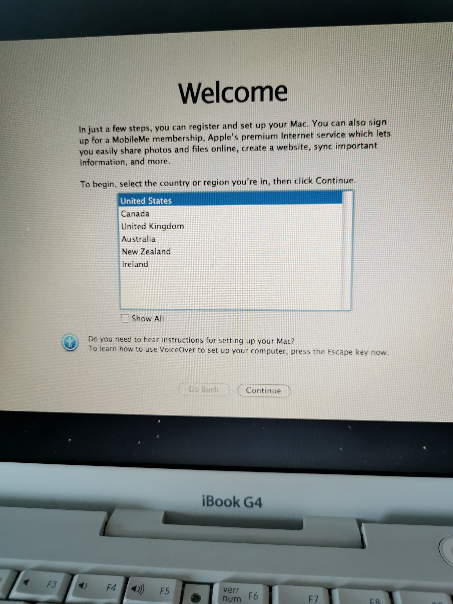
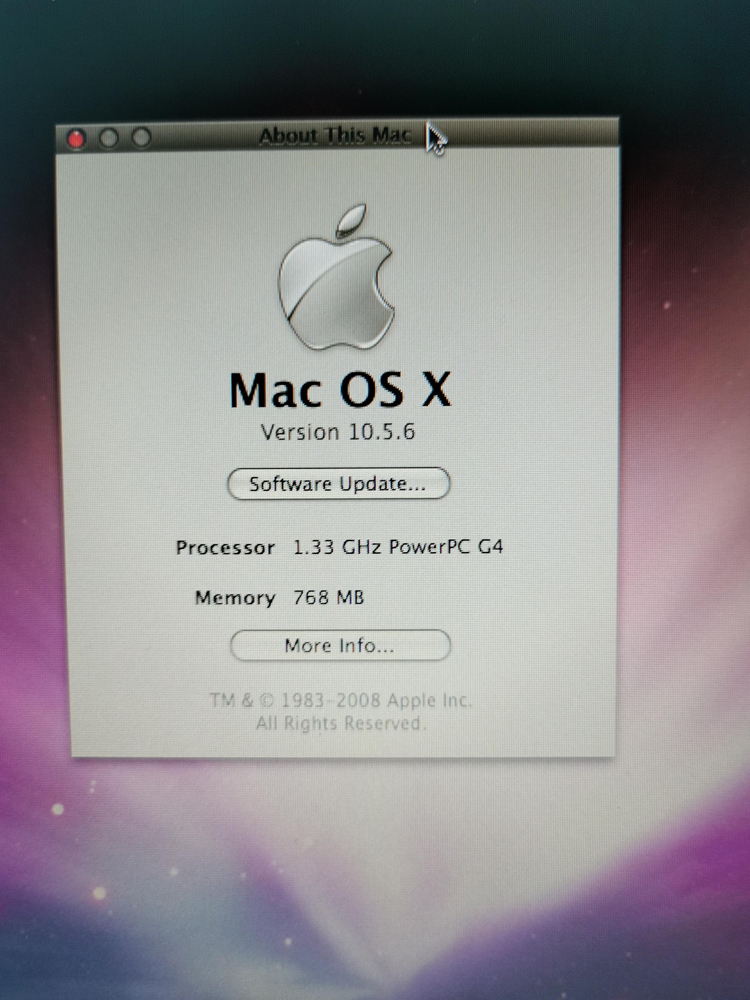

+++
title = 'iBook G4 Reinstallation'
date = 2024-07-16T20:20:23+02:00
draft = false
tags = [ 'Macintosh', 'Vintage' ]
image = 'ibookg4-title.png'
categories = [ 'Vintage' ]
+++

Recently I was gifted an old iBook G4, in working order.
This machine was the latest PowerPC based laptop produced by Apple.

As a good practice, I always reinstall a clean version of OS on those refurbished machine. 

This iBook G4 came installed in OSX Tiger (10.4 / 2005-2007), a splendid PowerPC G4 @ 1.33Ghz with 512MB of RAM and a large 40GB hard drive.

On PowerPC, OSX Leopard (10.5 / 2007-2009) was the latest version available so I decided to reinstall this machine from scratch.

## Disk Utils, format and patatra

I have a working Tiger DVD disk, so I decided to boot on it, reformat hard drive and install OSX Leopard.

I booted, reformated hard drive and started OSX installation but ... after a few minutes, installation was stopped and ultimatily iBook restarted.  

I tried many time, and no way. 

I tried with a Leopard DVD disk, same problem.

Conclusion iBook DVD drive is unsable for installation and probably damaged.

## Build a bootable USB with OSX Leopard 

Without Macintosh machines and working DVD drive, so I had look for Mac OSX Leopard image and found it on Archive.org, [Max OS X Leopard 10.5.6 (Retail ISO)](https://archive.org/details/mac-os-x-10.5.6-leopard-install-dvd)

I downloaded it on a Macintosh and used DIskUtils to make a bootable USB
I used the [CLI way](https://www.cybrary.it/blog/macos-terminal-create-bootable-usb-iso-using-dd), with diskutil and dd.

## USB Boot via OpenFirmware

Out of the box, those old Apple machines didn't know how to boot from USB but there is a trick via OpenFirmware.

OpenFirmware was Apple BIOS for PowerPC systems, used from 1994 to 2006 and with a lot of features.

2 features will be interesting here, browsing USB and booting from USB

**dev** and **ls**, are the commands to select a device and list contents

### Browsing USB 

I disconnected everything from the iBook and plugged an USB drive in first USB port (on the left)

I selected first usb

`dev usb0`

Then listed contents

`ls`

I found the drive on usb0 device, at disk@1

`ff9e3ba8: /disk@1`

### Booting from USB 

**probe-usb** is the command to boot from the USB drive

`probe-usb boot usb0/disk:1,\\:tbxi`

## Installation from USB, first try

Boot from USB took a few minutes, then I started OSX installation
After 10 minutes, the hard drive was doing the nasty sounds from the old age, a damaged sector was encountered and there was no way to go farther. 15 minutes later, installation process restarted iBook.

## Installation from USB, second try

Removing internal hard drive from an iBook G4 is not impossible but I didn't have a new working  2.5" ATA drive hard drive available, so I should find another way.

Only a few sectors seems in a trouble, so why not just move installation past this damaged area ?

### 2 partitions :)

The trick was to use 2 partitions, a void one (including the damaged area) and a working one (to do the installation)

I started **Disk Utility**

Internal hard drive selected, go to partition menu, 2 partitions here 

**Disk Utility** proposed 2 partitions of 50% capacity, 18.6GB here

I reduced void partitions to 4GB (after a few tries to determine the proper size)

The installation partition, will be 33.26GB large (more than enough)

Partitioning started ...

### Installation

I quitted Disk Utility and started installation

Installation goes to the end, no more damaged sectors being encountered during copy. 

Victory, the animated video by the end of installation

Added an 256MB DDR 2700 DIMM, iBook have now 768MB of RAM 

Apple update servers are still serving Mac OSX Leopard updates, first pass

And the very latest PowerPC Java version, Java 6...
