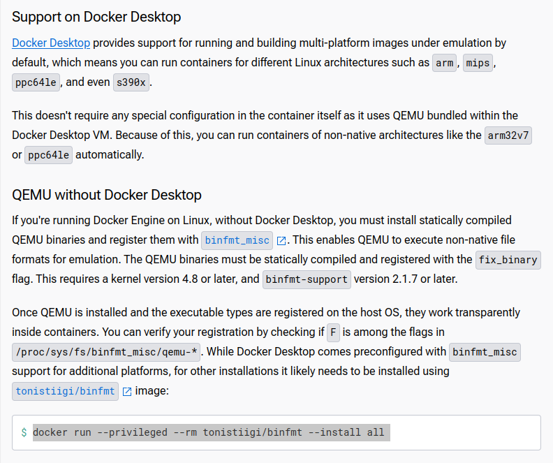

+++
title = 'Docker Build Multi Arch'
date = 2024-07-26T12:10:23+02:00
draft = false
tags = [ 'Docker', 'Maven' ]
image = 'dockerquarkusarmx86.png'
categories = [ 'Development' ]
+++

I was curious about the build process of [Quarkus Base Images](https://github.com/quarkusio/quarkus-images/) and especialy the [quarkus-micro-image:2.0](https://quay.io/repository/quarkus/quarkus-micro-image?tab=tags&tag=2.0)

The build process is unsurprisingly using Maven, JBang Maven Plugin and Quarkus JDoc.

I cloned the Quarkus Base Images repository and started Maven build (installation)

```
git clone git@github.com:quarkusio/quarkus-images.git 
cd quarkus-images
mvn install
```
Build failed a few minutes later

```
[INFO] 	at io.quarkus.images.Build.main(Build.java:75)
[INFO] Caused by: org.zeroturnaround.exec.InvalidExitValueException: Unexpected exit value: 1, allowed exit values: [0], executed command [docker, buildx, build, --load, --platform=linux/arm64, --tag, quay.io/quarkus/ubi-quarkus-mandrel-builder-image:23.1.4.0-Final-java21-arm64, -f, /home/henri/Documents/Github/quarkus-images/quarkus-mandrel-builder-image/target/docker/ubi-quarkus-mandrel-builder-image:23.1.4.0-final-java21-arm64.Dockerfile, .]
[INFO] 	at org.zeroturnaround.exec.InvalidExitUtil.checkExit(InvalidExitUtil.java:27)
[INFO] 	at org.zeroturnaround.exec.WaitForProcess.call(WaitForProcess.java:114)
[INFO] 	at org.zeroturnaround.exec.ProcessExecutor.waitFor(ProcessExecutor.java:1076)
[INFO] 	at org.zeroturnaround.exec.ProcessExecutor.execute(ProcessExecutor.java:906)
[INFO] 	at io.quarkus.images.utils.Exec.execute(Exec.java:25)
[INFO] 	... 13 more
[INFO] ------------------------------------------------------------------------
[INFO] Reactor Summary for Quarkus images 1.0-SNAPSHOT:
[INFO] 
[INFO] Quarkus images ..................................... SUCCESS [  1.123 s]
[INFO] jdock .............................................. SUCCESS [  1.937 s]
[INFO] jdock-variant-helper ............................... SUCCESS [  0.038 s]
[INFO] quarkus-micro-base-image ........................... SUCCESS [ 11.849 s]
[INFO] quarkus-distroless-base-image ...................... SUCCESS [ 11.205 s]
[INFO] quarkus-mandrel-builder-image ...................... FAILURE [ 14.424 s]
[INFO] quarkus-graalvm-builder-image ...................... SKIPPED
[INFO] quarkus-binary-s2i ................................. SKIPPED
[INFO] quarkus-native-s2i ................................. SKIPPED
[INFO] ------------------------------------------------------------------------
[INFO] BUILD FAILURE
[INFO] ------------------------------------------------------------------------
[INFO] Total time:  40.743 s
[INFO] Finished at: 2024-07-26T15:24:51+02:00
[INFO] ------------------------------------------------------------------------
[ERROR] Failed to execute goal dev.jbang:jbang-maven-plugin:0.0.7:run (default) on project quarkus-mandrel-builder-image: Error while executing JBang. Exit code: 1 -> [Help 1]
[ERROR] 
[ERROR] To see the full stack trace of the errors, re-run Maven with the -e switch.
[ERROR] Re-run Maven using the -X switch to enable full debug logging.
[ERROR] 
[ERROR] For more information about the errors and possible solutions, please read the following articles:
[ERROR] [Help 1] http://cwiki.apache.org/confluence/display/MAVEN/MojoExecutionException
[ERROR] 
[ERROR] After correcting the problems, you can resume the build with the command
[ERROR]   mvn <args> -rf :quarkus-mandrel-builder-image
```

Build failure while building an ARM64 image

```
[INFO] Caused by: org.zeroturnaround.exec.InvalidExitValueException: Unexpected exit value: 1, allowed exit values: [0], executed command [docker, buildx, build, --load, --platform=linux/arm64, --tag, quay.io/quarkus/ubi-quarkus-mandrel-builder-image:23.1.4.0-Final-java21-arm64, -f, /home/henri/Documents/Github/quarkus-images/quarkus-mandrel-builder-image/target/docker/ubi-quarkus-mandrel-builder-image:23.1.4.0-final-java21-arm64.Dockerfile, .]
```

Building ARM64 images on an AMD64 system requires some form of emulation. While Docker buildx supports multiple architectures, including ARM64, it relies on emulation for cross-platform builds.

Docker buildx reports support for only x86 architectures

```
docker buildx ls 

NAME/NODE     DRIVER/ENDPOINT   STATUS    BUILDKIT   PLATFORMS
default*      docker                                 
 \_ default    \_ default       running   v0.15.0    linux/amd64, linux/amd64/v2, linux/amd64/v3, linux/386
```

Let's have a look on Docker side, at [multiplatform support page](https://docs.docker.com/build/building/multi-platform/)


On Docker Desktop, multi Linux architectures is provided out of the box, otherwise you should  use QEMU and bring binfmt-support

```
sudo apt install qemu-utils qemu-system-x86 qemu-system-gui
docker run --privileged --rm tonistiigi/binfmt --install all
```
Let's verify the availability of additional architectures

```
docker buildx ls 
NAME/NODE     DRIVER/ENDPOINT   STATUS    BUILDKIT   PLATFORMS
default*      docker                                 
 \_ default    \_ default       running   v0.15.0    linux/amd64, linux/amd64/v2, linux/amd64/v3, linux/386, linux/arm64, linux/riscv64, linux/ppc64le, linux/s390x, linux/mips64le, linux/mips64, linux/arm/v7, linux/arm/v6
```

Perfect, let's attempt another build 

```
mvn install
....
```
 Build is going farther and take much more time

Let's investigate if QEMU is involved ... 

```
ps aux | grep /usr/bin/qemu

root 23396 49.5 0.6 522180 97700 ? Sl 12:35 0:07 /usr/bin/qemu-aarch64 /usr/bin/microdnf microdnf --setopt=install_weak_deps=0 --setopt=tsflags=nodocs install -y tar gzip gcc glibc-devel zlib-devel shadow-utils unzip gcc-c++ findutils
root 23439 0.0 0.0 226484 9476 ? Ssl 12:35 0:00 /usr/bin/qemu-aarch64 /usr/bin/gpg-agent gpg-agent --homedir /var/cache/yum/metadata/ubi-8-baseos-rpms-8-aarch64.tmp/gpgdir --use-standard-socket --daemon
root 23461 0.1 0.0 226484 9288 ? Ssl 12:35 0:00 /usr/bin/qemu-aarch64 /usr/bin/gpg-agent gpg-agent --homedir /var/cache/yum/metadata/ubi-8-appstream-rpms-8-aarch64.tmp/gpgdir --use-standard-socket --daemon
root 23487 0.2 0.0 226484 9348 ? Ssl 12:35 0:00 /usr/bin/qemu-aarch64 /usr/bin/gpg-agent gpg-agent --homedir /var/cache/yum/metadata/ubi-8-codeready-builder-rpms-8-aarch64.tmp/gpgdir --use-standard-socket --daemon
```

35mn later

```
[INFO] ------------------------------------------------------------------------
[INFO] Reactor Summary for Quarkus images 1.0-SNAPSHOT:
[INFO]
[INFO] Quarkus images ..................................... SUCCESS [ 0.422 s]
[INFO] jdock .............................................. SUCCESS [ 1.804 s]
[INFO] jdock-variant-helper ............................... SUCCESS [ 0.036 s]
[INFO] quarkus-micro-base-image ........................... SUCCESS [ 2.359 s]
[INFO] quarkus-distroless-base-image ...................... SUCCESS [ 2.573 s]
[INFO] quarkus-mandrel-builder-image ...................... SUCCESS [02:05 min]
[INFO] quarkus-graalvm-builder-image ...................... SUCCESS [01:54 min]
[INFO] quarkus-binary-s2i ................................. SUCCESS [ 42.879 s]
[INFO] quarkus-native-s2i ................................. SUCCESS [03:44 min]
[INFO] ------------------------------------------------------------------------
[INFO] BUILD SUCCESS
[INFO] ------------------------------------------------------------------------
[INFO] Total time: 08:35 min
[INFO] Finished at: 2024-07-26T15:43:32+02:00
[INFO] ------------------------------------------------------------------------
```

I now have a setup have to build Docker images for more than x86 architecture