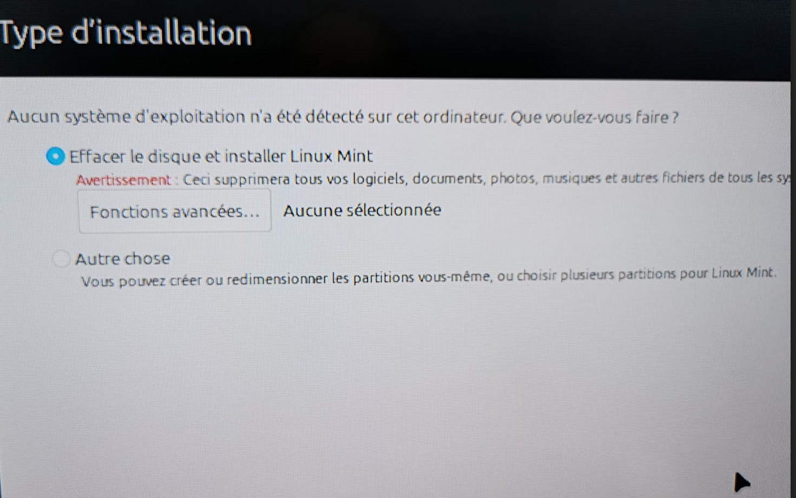

+++
title = 'Install Linux Mint 22 on a MacPro 2.1'
date = 2024-09-14T21:10:23+02:00
draft = false
tags = [ 'Vintage', 'Mint' ]
image = 'mint22-macpro21.png'
categories = [ 'Vintage' ]
+++

Once powerhouses, Apple Mac Pro machines remain usable today with the help of [OpenCore Legacy Patcher](https://github.com/dortania/OpenCore-Legacy-Patcher) (OCLP).

However, Mac Pro 1.1 and 2.1 aren't officially supported by OCLP. This means you'll likely be limited to macOS El Capitan (released in 2015). While [El Capitan](https://en.wikipedia.org/wiki/OS_X_El_Capitan) is still functional, most modern macOS software requires macOS 10.13 (High Sierra) or later versions like 10.15 (Catalina).

As a result, you cannot have up to date browsers nor SSL/TLS certificates and your Internet usage will be very limited.

So why not try to install Linux on those old MacPro 1.1/2.1 ?

I tried a few Linux distributions and it didn't goes well because those MacPro are 64bits machines but with a 32bits EFI (Bios)

You should have a 32 bits EFI in USB or MacPro won't recognize them at startup (keeping alt key down while booting)

### Ubuntu 24.04.1

* no 32 bits EFI in CD, Mac didn't recognized USB as bootable
```
EFI/boot/bootx64.efi
EFI/boot/grubx64.efi
EFI/boot/mmx64.efi
```
### Fedora 40 Workstation

* 32 bits EFI in CD
* installation failed at partition time
```
EFI/BOOT/grubia32.efi
EFI/BOOT/grubx64.efi
EFI/BOOT/mmia32.efi
EFI/BOOT/mmx64.efi
```

### Debian 12

* 32 bits EFI in CD
* Installation completed
* EFI partition tweaked from a Linux PC.
* System was a bit laggy to be usable
```
EFI/boot/bootia32.efi
EFI/boot/bootx64.efi
EFI/boot/grubia32.efi
EFI/boot/grubx64.efi
```

### Mint 22

* 32 bits EFI in CD
* installation completed
* EFI partition tweaked from a Linux PC.
* System was smooth
```
EFI/boot/bootia32.efi
EFI/boot/bootx64.efi
EFI/boot/grubx64.efi
```

Let's focus on Mint 22 installation as it was the most appropriate OS for my MacPro 2.1

* Dual Xeon 5150
* 32GB RAM (16 GB recognized due to 32bits EFI)
* Saphire Vapor-X Radeon HD 5770 (with BIOS flashed for Mac EFI)
* 2 OCZ Vertex 4  250Go SSD, one with El Capitan, another with Mint 22

````
Machine:
  Type: Unknown System: Apple product: MacPro2,1 v: 1.0
    serial: <superuser required>
  Mobo: Apple model: Mac-F42xxxx v: PVT serial: <superuser required>
    UEFI: Apple v: MP21.88Z.007F.B06.0707021348 date: 07/02/07
Memory:
  System RAM: total: 32 GiB available: 15.61 GiB used: 1.06 GiB (6.8%)
  Message: For most reliable report, use superuser + dmidecode.
  Array-1: capacity: 64 GiB slots: 8 modules: 8 EC: Single-bit ECC
  Device-1: DIMM Riser A type: DDR2 FB-DIMM size: 4 GiB speed: 667 MT/s
  Device-2: DIMM Riser A type: DDR2 FB-DIMM size: 4 GiB speed: 667 MT/s
  Device-3: DIMM Riser B type: DDR2 FB-DIMM size: 4 GiB speed: 667 MT/s
  Device-4: DIMM Riser B type: DDR2 FB-DIMM size: 4 GiB speed: 667 MT/s
  Device-5: DIMM Riser A type: DDR2 FB-DIMM size: 4 GiB speed: 667 MT/s
  Device-6: DIMM Riser A type: DDR2 FB-DIMM size: 4 GiB speed: 667 MT/s
  Device-7: DIMM Riser B type: DDR2 FB-DIMM size: 4 GiB speed: 667 MT/s
  Device-8: DIMM Riser B type: DDR2 FB-DIMM size: 4 GiB speed: 667 MT/s
CPU:
  Info: 2x 2-core model: Intel Xeon 5150 bits: 64 type: MCP SMP cache:
    L2: 2x 4 MiB (8 MiB)
  Speed (MHz): avg: 2562 min/max: N/A cores: 1: 2660 2: 2660 3: 2271 4: 2660
Drives:
  Local Storage: total: 484.41 GiB used: 9.85 GiB (2.0%)
  ID-1: /dev/sda vendor: OCZ model: VERTEX4 size: 238.47 GiB
  ID-2: /dev/sdb vendor: OCZ model: VERTEX4 size: 238.47 GiB
  ID-3: /dev/sdc model: USB Flash Disk size: 7.46 GiB type: USB
  ````

  
### Mint 22 installation

While installing Mint 22, I modified the GRUB menu's startup options to include `nosplash` and `noefi` parameters. 

I leveraged and adapted information about installing Ubuntu from [this site](https://pila.fr/wordpress/?p=1511)


The screen went black for a few minutes while the Mac Pro loaded files from the USB drive. Afterward, I saw the Mint desktop screen and began the installation process.

]




After the installation was complete, I edited `/etc/default/grub` to disable EFI

```
GRUB_CMDLINE_LINUX="noefi"
```

If your graphics card doesn't have Apple firmware, disable the splash screen.

```
GRUB_CMDLINE_LINUX_DEFAULT="quiet nosplash"
```

I also added `noefi` to all Linux startup definitions in the `/boot/grub/grub.cfg` file, placing it between `ro` and `quiet`. If your graphics card doesn't have Apple firmware, you should replace `splash` with `nosplash` as well.


Then I shut down the Mac, removed the SSD from the Mac Pro, and inserted it into a USB drive. This allowed me to modify the contents on my Linux machine.

I mounted the EFI partition on my Linux machine and copied Debian 12 `bootia32.efi` and `grubia32.efi` to `EFI/BOOT` directory

EFI partition details

```
total 8
4 drwx------ 3 root root 4096 sept. 10 10:23 boot
4 drwx------ 4 root root 4096 sept. 10 10:23 EFI

./boot:
total 4
4 drwx------ 2 root root 4096 sept. 10 10:23 grub

./boot/grub:
total 4
4 -rwx------ 1 root root 126 sept. 10 10:23 grub.cfg

./EFI:
total 8
4 drwx------ 2 root root 4096 sept. 10 10:23 BOOT
4 drwx------ 2 root root 4096 sept. 10 10:23 ubuntu

./EFI/BOOT:
total 6300
3672 -rwx------ 1 root root 3757504 sept. 10 10:23 grubia32.efi
 752 -rwx------ 1 root root  768816 sept. 10 10:23 bootia32.efi
 840 -rwx------ 1 root root  856280 sept. 10 10:23 mmx64.efi
  88 -rwx------ 1 root root   88344 sept. 10 10:23 fbx64.efi
 948 -rwx------ 1 root root  966664 sept. 10 10:23 BOOTX64.EFI

./EFI/ubuntu:
total 4392
   4 -rwx------ 1 root root     126 sept. 10 10:23 grub.cfg
   4 -rwx------ 1 root root     108 sept. 10 10:23 BOOTX64.CSV
 840 -rwx------ 1 root root  856280 sept. 10 10:23 mmx64.efi
 948 -rwx------ 1 root root  966664 sept. 10 10:23 shimx64.efi
2596 -rwx------ 1 root root 2656136 sept. 10 10:23 grubx64.efi
```

I reinstalled the SSD into the Mac, restarted the computer while holding down the Alt key to access the boot picker, and then selected the **EFI Boot** to boot into Mint 22 :)


